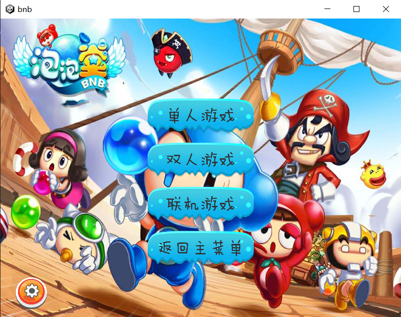
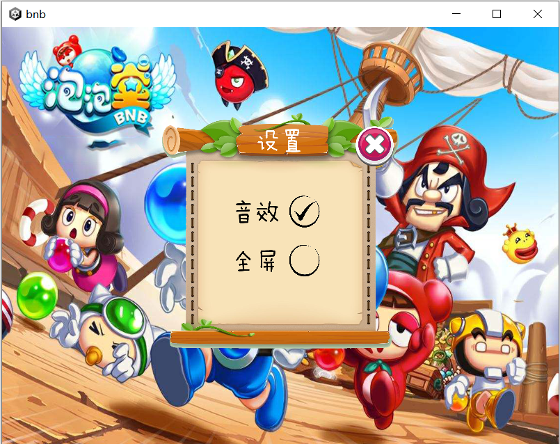
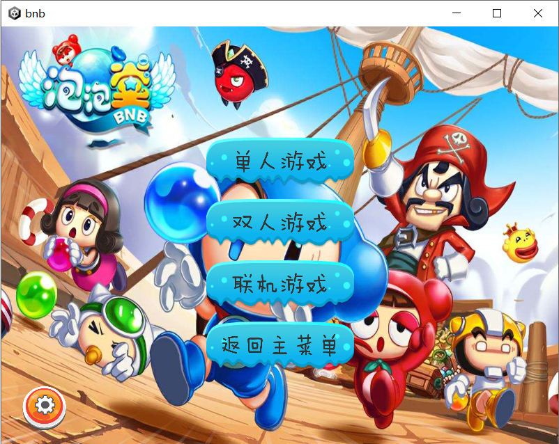
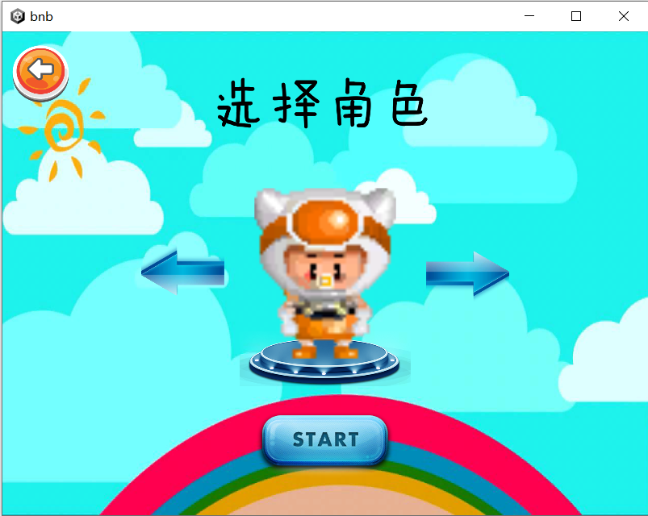
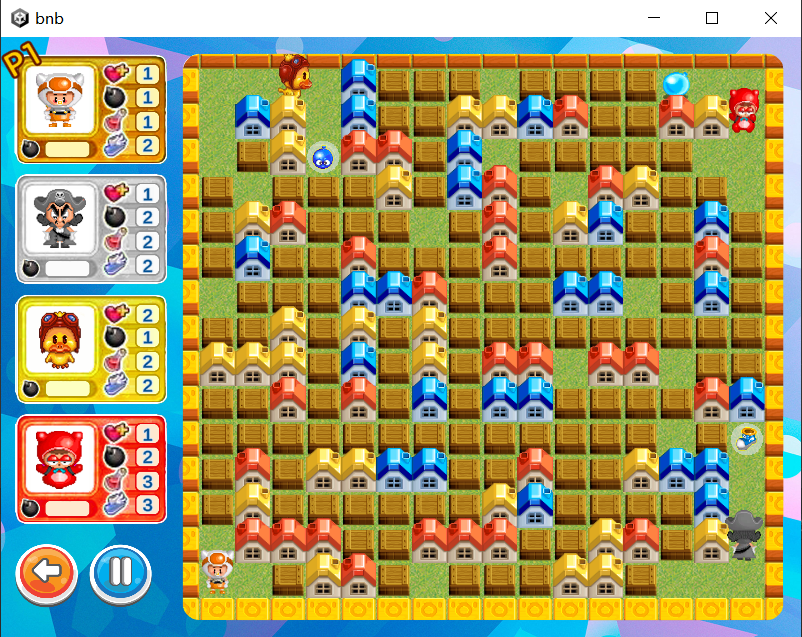
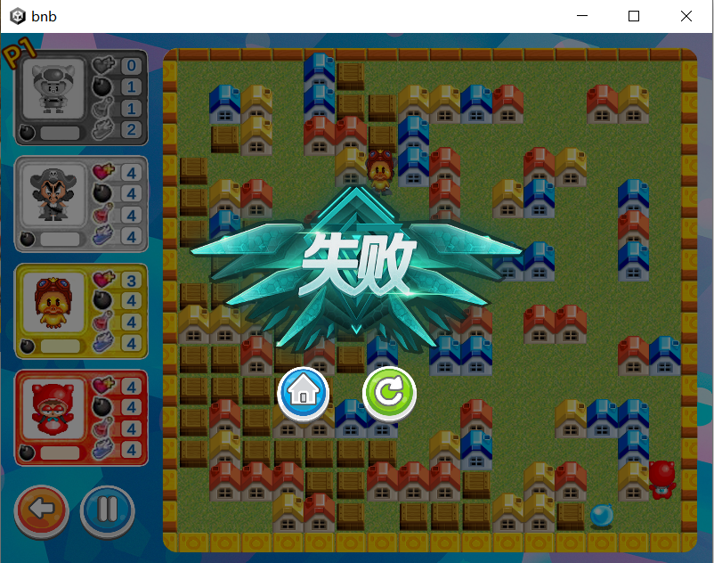
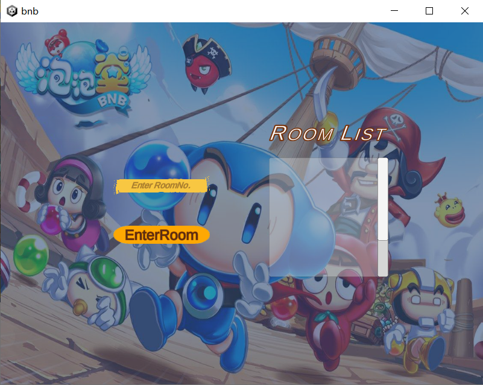
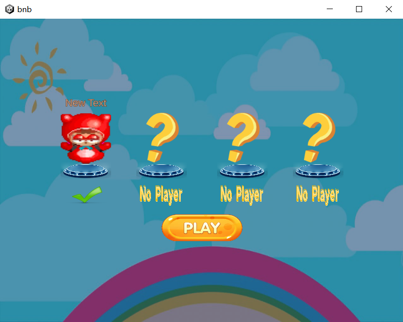

# BNB

基于Unity的泡泡堂游戏

组长：王知衡  组员：尚子智  陈伯驹

------

## 一、游戏介绍

泡泡堂（BNB）是一款经典的小游戏，游戏规则是炸箱子吃道具，躲避危险，放泡泡把别的人物炸死获得胜利。

本游戏采用Unity实现，包括以下几个场景：MainMenu、SelectRole、SelectRole2、LobbyRoom、GameScene1、GameScene2。

## 二、实现的功能

- 基本功能

  - [x] 支持地图（多种）绘制、人物（5种）绘制、泡泡效果绘制

  - [x] 支持鼠标与键盘操作交互

  - [x] 支持障碍物（障碍物随机生成颜色）

  - [x] 支持泡泡的放置和爆炸

  - [x] 支持四种基本增强型道具（鞋子、泡泡、药水、心）

  - [x] 支持单/双人游戏

  - [x] 支持与AI人机对战

  - [x] 实现网络联机：支持多人在不同客户端一起游戏

  - [x] 支持动画效果（人物行走动画、泡泡和道具放缩动画等）
- 拓展功能

  - [x] 支持房间列表

  - [x] 支持拓展道具，添加无系元素（电磁波发射器、随手推、随机过程传送门）

## 三、具体实现方式

### 1、基本游戏场景的搭建

#### (1) 主菜单（MainMenu）

主菜单中包括开始游戏、退出游戏、选择游戏模式和设置几个功能，挂载脚本Menu.cs。

Menu.cs中包含以下几个全局变量，控制整个游戏的设置：

```c#
public static int mode = -1;//0:单人 1:双人 2:联机
public static bool sound = true;//true:有音效 false:无音效
public static bool isFullScreen;//true:全屏 false:非全屏
public static int[] screenSize = new int[2] { 800, 600 };//若不全屏窗口大小
```

选择单人游戏进入SelectRole场景，选择双人游戏进入SelectRole2场景，选择联机游戏进入LobbyRoom场景。

设置界面可设置**是否全屏**、**有无音效**，通过

```c#
Screen.fullScreen = true;
isFullScreen = true;
Resolution[] resolutions = Screen.resolutions;
Screen.SetResolution(resolutions[resolutions.Length - 1].width, resolutions[resolutions.Length - 1].height, true);
```

设置全屏，通过

```c#
Screen.fullScreen = false;
isFullScreen = false;
Screen.SetResolution(screenSize[0], screenSize[1], false);
```

设置小窗口。小窗口状态下可自由调整窗口大小。

#### (2) 选择角色界面（SelectRole）

该场景创建不会被自动Destroy的游戏对象来储存角色选择信息，以避免游戏场景切换导致角色选择信息丢失，待GameScene中根据角色选择信息生成相应角色再Destroy该对象。

双/多人游戏中不能选择相同角色。

#### (3) 游戏场景（GameScene）

##### ①基本规则

游戏地图中的障碍物根据提前预设好的地图随机生成，箱子随机生成，四个玩家位置在四个角随机生成。

单人模式：使用WSAD控制角色移动，空格键放泡泡；

双人模式：P1：使用WSAD控制角色移动，空格键放泡泡；P2：使用↑↓←→控制角色移动，回车键放泡泡。

放置泡泡和道具后，物体会有波动特效。泡泡3s后爆炸,产生冲击波特效，道具如果不被拾起30s后消失。

泡泡爆炸时运用协程使炸弹波从中间到四周依次产生（而非一起产生），形成爆炸的效果。

当炸弹波触碰角色时，角色生命值-1，并在受伤后进入3s无敌状态（闪烁），当角色生命值为0时死亡并产生死亡特效（被炸成灰）。

当炸弹波触碰到未爆炸的泡泡时，该泡泡立刻爆炸。

角色之间不会发生碰撞，角色离开泡泡后会与泡泡发生碰撞。

为了解决角色和墙体有一点触碰时会被卡住，不利于玩家游戏体验，Role预制体采用多边形刚体，在角色和墙体有一点触碰的时候，可以滑过墙体朝指定方向运动。

无系大冒险模式中添加以下道具：

随机过程传送门：随机传送到其他传送门中的一个，传送后3s内不能再次传送

随手推：触碰炸弹可以将其推动

电磁波发射器：向一个方向释放具有杀伤力的电磁波

该模式中，炸毁箱子可以获得金币，用金币在商店中购买道具即可使用。

##### ②代码实现

**ⅰ.GameManager.cs**

游戏场景主要由挂载在GameManager游戏对象上的GameManager.cs脚本控制。

GameManager.cs中用枚举类定义了每个格子可能的类型：

```c#
public enum ItemType
{
	EMPTY,
	BARRIAR,
	BOX,
	TOOL,
	BOMB
}
```

属性主要包括：

- 属性`public GameObject[,] itemsObject`和`public ItemType[,] itemsType`用以记录所有位置上的游戏对象和类型。

- 属性`Array<GameObject> roleList`记录游戏中的角色对象，其中Array是自定义的泛型类，与List的区别在于移除对象后其他对象的index不会改变（后面有用）。


- 属性`public int[] bombNumbers`记录各个角色已经放置的泡泡数量。

方法主要包括：

- GameManager.cs中的Update()：

```c#
private void Update()
{
	if (isGameOver)
		return;

    //判定胜利与失败
    if (mode == 0)//单人模式
    {
        if (roleList.Count == 1 && roleList.GetT(0) != null)
        {
            isGameOver = true;
            Victory();
        }
        else if (roleList.GetT(0) == null)
        {
            isGameOver = true;
            Defeat();
        }
    }

    if (mode == 1)//双人模式
    {
        if (roleList.Count == 1 && (roleList.GetT(0) != null || roleList.GetT(1) != null))
        {
            isGameOver = true;
            Victory();
        }
        if ((roleList.GetT(0) == null && roleList.GetT(1) == null) && roleList.Count >= 1)
        {
            isGameOver = true;
            Defeat();
        }
    }
    
    if(mode == 2)
    {
        //见“网络联机”部分
    }

    //更新屏幕大小
    if (!Menu.isFullScreen)
    {
        Menu.screenSize = new int[2] { Screen.width, Screen.height };
    }
}
```

- `public GameObject PlaceBomb(Vector3 position, int bombRadius, int host)`：

  position：放置泡泡的角色位置，

  bombRadius：该角色放置的泡泡半径，

  host：角色序号
  
  return：生成的炸弹对象，default：null

- `public IEnumerator BombExplode(GameObject bombObject)`：

  炸弹对象在生成后3s后开启`BombExplode`协程，将该函数写成协程的目的主要是让炸弹波从中间到四周依次产生（而非一起产生），形成爆炸的效果，优化用户体验。

  该协程函数会通过查询`itemsType`和`itemsObject`来找到和消除箱子，箱子消除时调用`CreateRandomTool`，并在爆炸波该产生的位置调用`ExplodeEffect`函数产生爆炸波对象。

- `private void ExplodeEffect(int x, int y, int isEnd, int direction)`：

  x,y：爆炸波产生的坐标

  isEnd，direction：爆炸波是否是末端、方向，方便修改爆炸波对象Sprite

- `private void CreateRandomTool(int x, int y)`：在指定位置随机产生道具。

**ⅱ.Person.cs**

Role预制体上挂载了Person.cs脚本，主要实现移动和放置泡泡两个功能，除此之外还有实现无敌效果等。

属性主要包括：

- `public int PlayerNO`：PlayerNO=0时为AI，PlayerNO>0时为玩家
- `public float speed = 2.0f`：移动速度，初始为2.0
- `public int NO`：角色长什么样
- `public int index`：第几个出生
- `public int bombNumber`：最大放置泡泡数量
- `public int bombRadius`：炸弹半径
- `public int life`：当前生命值，初始为1

方法主要包括：

- `public void Move(int direction)`可以控制角色向指定方向移动，并切换相应动画。

- `public void Fire()`调用GameManager.cs中的`PlaceBomb(Vector3 position, int bombRadius, int host)`。

Person.cs中还包括AI脚本，详见第三部分。

其余代码见源码，不一一描述。

### 2、游戏UI

#### 主菜单



#### 设置



#### 副菜单



#### 选择角色



#### 游戏界面（普通）



#### 游戏界面（无系大冒险）


#### 失败



#### 联机游戏大厅





### 3、游戏AI

#### (1)总体设计

游戏AI设计的功能主要有：自动确定目标，搜索最短路径，自动循迹，放置泡泡，躲避危险，竞争道具，主动攻击（待开发）

AI部分主要在Person.cs中实现，AI角色属性包括Person.cs中为player定义的基础属性，以及为AI功能专门定义的属性

AI专用属性主要包括：

- `public int moveState`：AI当前运动状态 -1:静止 0:下 1:左 2:右 3:上
- `public int targetType`：AI搜索目标类型 
- `public bool canFire`：是否可以进行泡泡放置
- `public bool isFound`：是否搜索到了目标
- `public int delta`：调控状态更新间隔
- `public int check`：预防怼墙，提高鲁棒性

（其他功能性属性详见源码）

AI专用方法主要包括：

- `private void MoveByAi()`：控制AI实际运动，错误状态检查和修复
- `private void FireByAi()`：通过canFire属性来决定是否放置泡泡 
- `public void StateUpdate()`：调整AI角色的运动状态，组织搜索、循迹、躲避、进攻的逻辑

详细思路见（2）具体实现

#### (2)具体实现

##### ①AI主要运行思路

基本运动：`private void MobeByAi()`调用`public void Move(int direction)`产生实际运动，传递参数为`moveState`

泡泡放置：`private void FireByAi()`调用`public void Fire()`来放置炸弹实例

事件优先级：躲避危险 > 竞争道具 > 搜寻箱子 > 进攻玩家，优先级高的事件可以打断优先级低的事件，具体实现在`public void StateUpdate()`中

四个事件中用到的搜索算法是BFS算法`private bool Bfs(int type)`，通过堆排序和栈反演路径来进行搜索和循迹，具体实现内容通过参数`tpye`来决定，该算法在各个运动状态更新函数中被调用

躲避危险：在GameManager.cs中实时更新危险区数组`public List<Bomb>[,] bombRange`，AI对当前位置以及下一目标位置进行`public bool IsSafe()`判断，若危险则调用`public bool SafeUpdate()`寻找安全位置并更新`moveStete`，直至抵达安全位置

竞争道具：AI调用`public bool TargetUpdate()`搜索最近的道具，并规划路线，并更新`moveState`，直至吃掉道具

搜寻箱子：AI调用`public bool TargetUpdate()`搜索最近的箱子，并规划路线，并更新`moveState`，直至抵达箱子临点，并放置炸弹

进攻玩家：AI调用`public bool AttackUpdate() `开展最终状态下的进攻，主要思路是随机行动，并不定时释放炸弹，由于AI对于炸弹的躲避能力很强，因此随机对于炸弹的释放即对自身有利

具体代码见源码，不一一描述

##### ②AI相关优化

初期AI易出现"怼墙"、"反复横跳"、"静止卡死"、"被炸弹误炸"等错误，鲁棒性低，后期进行了下列优化

中心判断：`private bool IsCenter(Vector3 dest)`判定AI角色当前是否处于地图格点中心区域，在中心区域实现转向、躲避

卡死检测：通过定义属性`public int check`来检测不正常状态，设置`public bool reverse`标志，在`private void MobeByAi()`中对不正常状态进行修正

静止态避免：通过在定义属性`public int counterStep`和`public int counterPeace`来调整丧失所有目标后的静止态，并产生随机行动


### 4、网络联机

​		在本次提交的游戏demo中，网络通信部分使用的是Photon（光子云），申请了中国区能够同时容纳20CCU的免费服务器，进行游戏框架的搭建。在Unity中，使用了PUN（Free）插件进行网络通信。并且基于联机游戏的相关要求，制作了相关部分的游戏UI，包括联机时的Lobby（大厅）用于显示当前存在的房间列表，通过点击相关房间按钮，或者输入房间名称可以实现加入或者创建房间的功能，进入房间后，首先进行的是游戏人物的选择，通过实时Update（主要使用RPC传递信息），保证房间内游戏人物的唯一性（角色不能重复），在按下Ready按钮后，进入准备完毕状态，同时房主端会出现Play按钮，当房间内所有的游戏玩家都进入Ready状态后，房主可以选择进入游戏场景，同时，每个玩家的房间序号LocalOnlineIndex会作为玩家属性的一部分同步到整个房间的PlayerList中。
​       进入游戏场景后，基于原本单机游戏的框架，在MasterClient端会进行地图的生成，如果房间人数小于4，在主客户端还会生成相应数量的游戏AI，使整个房间的人数达到4人。在每个客户端，进行各自所选游戏角色的生成，通过Player预制体身上挂载的PhotonView和PhotonView Transform组件，PhotonView组件主要负责整个联机信息的监测，每个联机物体会生成分配自己的一个ID（有点类似IP地址），其Photon  Transform组件可以进行实时的位置传输（会受到网络延时的影响），通过主客户端的roleList的玩家属性，通过PRC指令传到客户端，进行人物血量等的同步。

在主菜单界面下，选择“联机游戏”模式即可开始联机游戏。


出现此界面代表正在进行网络通信连接，连接完成后进入如下界面：


在对话框中输入游戏名称，点击start按钮即可进入游戏大厅（注意名称需要大于3个字符，否则会被定义为无效名称！）


​		在此处，可以通过选择通过输入房间名称创建房间，如果该名称的房间已经被创建，会出现在右侧的RoomList中，如果点击相关房间的按钮就能够进入房间，同样，输入房间号也可以进入该房间。

​		在进入房间后，程序会实时通过检查Photon特有的PlayerList检查房间中玩家的状态，同时玩家也可以通过设置个人属性，通过PhotonNetwork指令将数据传输到服务器，方便其他玩家获取信息。

​		首先在选择角色的时候，每锁定一个角色，通过RPC通信，使得其他玩家不可选择相同角色，在确定角色后，点击确定按钮可以进入准备完成状态，当所有玩家都进入准备完成状态后，房主可以通过开始游戏按钮进入下一个场景（当房间内有玩家没有准备完毕，按钮无法触发事件！）

​		进入游戏场景后，为了设置了三秒钟的初始化时间，此期间玩家和AI均无法移动！此后，通过每个玩家控制人物身上的PhotonTransform组件，可以实时进行位置更新。我们在游戏的过程中，以主客户端（房主）作为整个游戏的Manager，通过其传递更新诸如玩家当前生命，GameUI显示等属性（避免了可能由于网络波动而出现的不同步情况），整个联机框架基于原有的单机框架，又进行了较大的改动，能够很好的进行数据的同步传输，实现预期效果！
